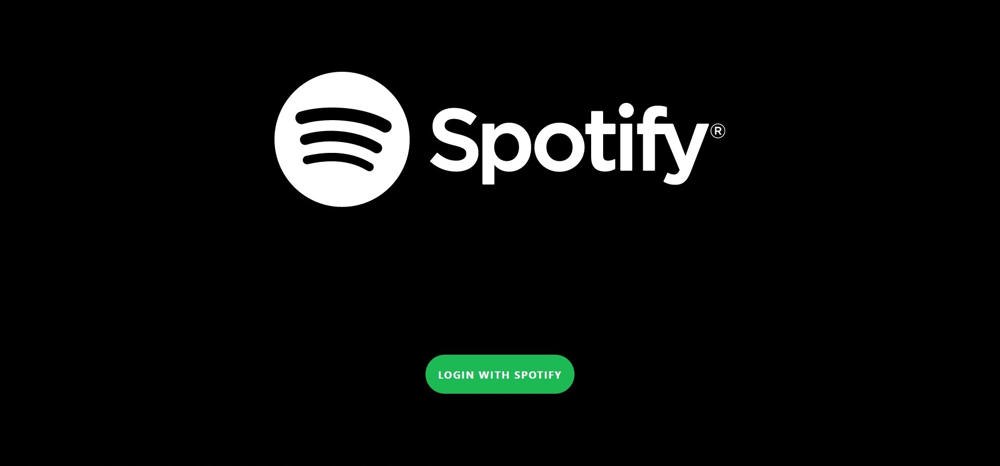
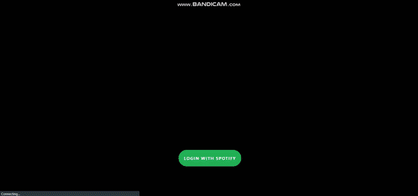

# SPOTIFY WEB ClONE

## Spotify authentication by your Spotify Account

### Spotify Clone Login



### Spotify Clone GIF



## Tech Used:

1. [Create React App](https://github.com/facebook/create-react-app) -> for creating the Template of the Project.
2. [Firebase](https://github.com/firebase) -> For Deployment of the Project/App.
3. [spotify-web-api-js](https://github.com/JMPerez/spotify-web-api-js) -> For the Authentication and fetching of all playlists,tracks and much more.
4. [node-sass](https://github.com/sass/node-sass) -> node-sass is a sass compiler.
5. [react-router-dom](https://github.com/ReactTraining/react-router) -- For Routing Between Pages.
6. [material-ui](https://github.com/mui-org/material-ui) -- For Some PreBuilt Components and Icons.
7. [react-spinners](https://github.com/davidhu2000/react-spinners) -> React Spinners is a library for loading animattions.
8. [numeral](http://numeraljs.com/) -> numeral is a library for handling the numbers.

## Installation

```
npm install
```

## Add your spotify client id to spotify.js file

## Start The App

```
npm start
```

## Build The Project

```
npm run build
```
